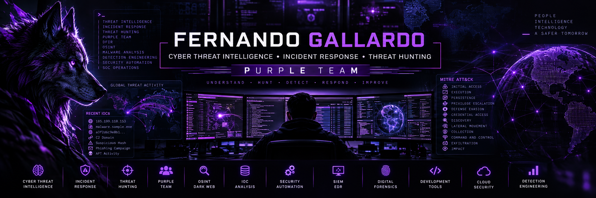
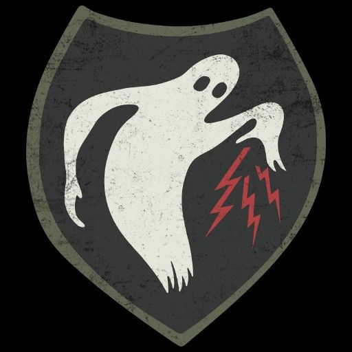
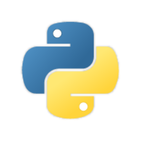
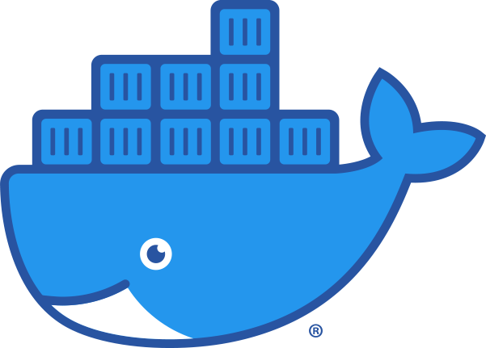

<!--
This is a ✨ _special_ ✨ repository because its README.md appears on your GitHub profile.
-->

<div align="center">



<br>

# Hello, I'm M4V3R1CK 👋

### 🟣 Cyber Threat Intelligence • Incident Response • Threat Hunting • Purple Team

</div>

```text
   _   ___ __ _   _ ____ __   _ _____  _ __
  / | /  / _ | | / / __/ _ \ / // ___// //_/
 / /|_/ / __ | |/ / _// , _/ // /__ /  ,<
/_/  /_/_/ |_|___/___/_/|_|\___//_/|_| ft.Odr4ll4G
```



```zsh
M4V3R1CK@PurpleTeam
-------------------------
Name: Fernando Gallardo
Role: Cyber Intelligence & Incident Response
Focus: Purple Team Operations

OS: Parrot Security / Kali Linux
Shell: PowerShell / Bash

CTI: IOC Analysis, OSINT, Threat Actors
IR: Incident Response, DFIR, RCA
Hunting: TTP & Behavioral Hunting
Framework: MITRE ATT&CK / Cyber Kill Chain

SIEM: Splunk / Wazuh
IR Platform: TheHive / Cortex
Automation: Python / n8n
Infrastructure: Docker / Linux

Languages: Python, PowerShell, Bash
Current Mission: Intelligence → Detection → Response
```

<br clear="left"/>

---

## 🟣 Purple Team Profile

I am a cybersecurity professional focused on **Cyber Threat Intelligence, Incident Response, Threat Hunting and Purple Team operations**.

My work focuses on understanding adversary behavior, transforming threat intelligence into actionable information, proactively hunting threats and improving organizational detection and response capabilities.

```text
        🔴 ADVERSARY KNOWLEDGE
                  │
                  ▼
         ┌─────────────────┐
         │   PURPLE TEAM   │
         │                 │
         │       CTI       │
         │  Threat Hunting │
         │    Detection    │
         │   Simulation    │
         │    Response     │
         └────────┬────────┘
                  │
                  ▼
         🔵 DEFENSIVE SECURITY
```

> **Understand the adversary. Hunt the behavior. Improve detection. Accelerate response.**

---

## 🧠 Cyber Threat Intelligence

My CTI activities focus on collecting, enriching and analyzing intelligence that can be operationalized by **SOC, Threat Hunting and Incident Response teams**.

<p align="center">


</p>

### Intelligence Workflow

```text
Collection
    │
    ▼
Processing
    │
    ▼
IOC Enrichment
    │
    ▼
Threat Analysis
    │
    ▼
MITRE ATT&CK Mapping
    │
    ├─────────────┐
    ▼             ▼
Threat Hunting   Detection
    │             │
    └──────┬──────┘
           ▼
   Incident Response
```

### CTI Capabilities

`IOC Analysis` • `Threat Actor Analysis` • `OSINT` • `Dark Web Monitoring`

`Campaign Analysis` • `TTP Mapping` • `Threat Intelligence` • `IOC Enrichment`

---

## 🚨 Incident Response & DFIR

My Incident Response activities cover the investigation lifecycle from detection through containment, recovery and lessons learned.

<p align="center">


</p>

```text
PREPARATION
     │
     ▼
DETECTION & ANALYSIS
     │
     ▼
CONTAINMENT
     │
     ▼
ERADICATION
     │
     ▼
RECOVERY
     │
     ▼
LESSONS LEARNED
     │
     ▼
DETECTION IMPROVEMENT
```

### Areas of Focus

🔎 Log & Event Analysis  
🌐 Network Traffic Analysis  
💾 Digital Forensics  
🦠 Ransomware Investigation  
🧩 Timeline Reconstruction  
🎯 IOC Identification  
🧠 TTP Analysis  
🔍 Root Cause Analysis  
🛡️ Containment & Remediation  
📚 Lessons Learned

---

## 🎯 Threat Hunting

Threat Hunting connects intelligence with telemetry to proactively identify adversary behavior.

```text
        THREAT INTELLIGENCE
                 │
                 ▼
        HUNTING HYPOTHESIS
                 │
                 ▼
         TELEMETRY ANALYSIS
                 │
                 ▼
         TTP / BEHAVIOR
            DETECTION
                 │
                 ▼
          INVESTIGATION
             ┌───┴───┐
             ▼       ▼
          INCIDENT  DETECTION
          RESPONSE   IMPROVEMENT
```

<p align="center">


</p>

---

# 🛠 Cybersecurity Arsenal

## 🧠 CTI / Incident Response

<p align="center">


</p>

---

## 📊 SIEM / Detection

<p align="center">


</p>

---

## 🛡️ Network & Endpoint Security

<p align="center">


</p>

---

## 🔍 Security Analysis

<p align="center">


&nbsp;&nbsp;&nbsp;

&nbsp;&nbsp;&nbsp;

&nbsp;&nbsp;&nbsp;

&nbsp;&nbsp;&nbsp;


</p>

---

## 💻 Security Operating Systems

<p align="center">


&nbsp;&nbsp;&nbsp;

&nbsp;&nbsp;&nbsp;


</p>

---

## ⚙️ Automation & Development

<p align="center">


&nbsp;&nbsp;&nbsp;

&nbsp;&nbsp;&nbsp;

&nbsp;&nbsp;&nbsp;


</p>

<p align="center">


</p>

---

# 🔬 Current Security Projects

## 🧠 IOC Intelligence Platform

Development of a Cyber Threat Intelligence platform designed to **centralize, enrich, analyze and operationalize Indicators of Compromise**.

```text
        THREAT SOURCES
              │
              ▼
        IOC COLLECTION
              │
              ▼
          DATABASE
              │
              ▼
        IOC ENRICHMENT
         ┌────┼────┐
         ▼    ▼    ▼
        VT   ASN  Reputation
         └────┼────┘
              ▼
        CTI ANALYSIS
              │
        ┌─────┼─────┐
        ▼     ▼     ▼
       SOC  HUNTING  IR
```

### Technology Stack

<p>


</p>

---

## 🐝 CTI & Incident Response Automation

Automation and orchestration environment integrating threat intelligence with incident response workflows.

```text
                CTI
                 │
                 ▼
            ┌─────────┐
            │ TheHive │
            └────┬────┘
                 │
                 ▼
             ┌────────┐
             │ Cortex │
             └────┬───┘
                  │
          ┌───────┼────────┐
          ▼       ▼        ▼
       Analysis   IOC    Automation
                  │
                  ▼
              RESPONSE
```

---

# 📜 Certifications & Background

<p align="center">


</p>

🎓 **Computer Systems Engineering**

🔐 **Cybersecurity Specialization**

⚔️ **Ethical Hacking**

🧠 **Cyber Threat Intelligence**

🚨 **Incident Response**

🎯 **Threat Hunting**

---

# ⚙️ GitHub Analytics

<div align="center">


<br><br>


</div>

---

# 📫 Connect With Me

<div align="center">

<a href="https://www.linkedin.com/in/gallardomtz/">

</a>

<a href="https://github.com/gallardowolfcode">

</a>

<br><br>


</div>

---

<div align="center">

## 🟣 THINK PURPLE

### `INTELLIGENCE → HUNT → DETECT → RESPOND → IMPROVE`

**Understand the adversary • Hunt the behavior • Detect the attack • Respond faster**

<br>


<br><br>

### 👾 `M4V3R1CK`

*"Know your adversary. Know your environment."*

</div>